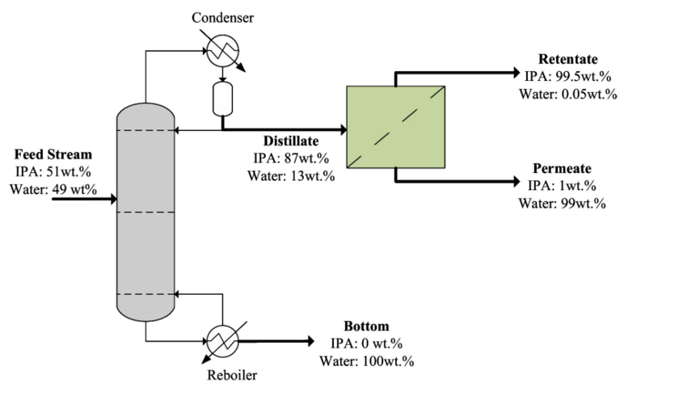

---
kernelspec:
  name: python3
  display_name: Python 3
---

# Isopropanol (IPA) Recovery from a Pharmaceutical Waste Stream

## Description: 

Celecoxib is the active ingredient in Celebrex, a medication used to treat arthritis. Its production involves downstream purification steps such as centrifugation and drying, which generate isopropanol (IPA) laden waste streams. This case study focuses on the dryer distillate, which is modeled as a binary mixture containing 51 wt.% IPA and 49 wt.% water at a flow rate of 1,000 kg/hr. The recovery of IPA from this stream is limited by the IPA-water azeotrope, which occurs at approximately 87.7 wt.% IPA and 80.37 °C. As a result, distillation alone cannot achieve the required IPA purity. To overcome this limitation, distillation is combined with pervaporation, a membrane-based separation process that enables separation beyond the azeotropic composition and recovery of high-purity IPA.



| Step 1: Distillation | Step 2: Pervaporation |
| :--: | :--: |
| The distillation column, equipped with a kettle reboiler and an overhead condenser, performs the initial separation by removing most of the water and concentrating IPA to approximately 88 wt.%, near its azeotropic limit. It handles the bulk separation; however, because of the IPA-water azeotrope, it cannot further increase the IPA purity on its own | The concentrated IPA-water mixture is sent to the pervaporation membrane, which selectively removes water under vacuum. This allows the separation to move beyond the azeotropic limit, producing high-purity IPA as the retentate. The water-rich permeate passes through the membrane, where it is subsequently condensed and removed |

***

**IPA Recovery Flowsheet — Distillation + Pervaporation (Animated) Code**

```{code-cell} python
:tags: [thebe-active-cell]
%matplotlib inline
import matplotlib.pyplot as plt
import matplotlib.patches as patches
import matplotlib.animation as animation
from IPython.display import HTML

plt.ioff()  # don't auto-display the figure after every cell; we only want
            # the final inline animation to show, once everything is drawn

# ============================================================ SETTINGS ===
OUTPUT_FILE = "ipa_flowsheet_animated.gif"
FPS = 24
DURATION_SECONDS = 3.5           # length of one loop
FRAMES = int(FPS * DURATION_SECONDS)

# ---------------------------------------------------------------- colors --
INK = "#111111"
GRAY_COL = "#BEBEBE"
MEMBRANE = "#A9C88A"
DASH_PATTERN = (6, 5)             # (on, off) in points
DASH_CYCLE = sum(DASH_PATTERN)
```

## Helper Functions


```{code-cell} python
:tags: [thebe-active-cell]
def add_arrowhead(ax, x_tip, y_tip, direction="right", size=13):
    """Static right-pointing (or other axis-aligned) triangular arrowhead."""
    dx = {"right": -1, "left": 1, "up": 0, "down": 0}[direction]
    dy = {"right": 0, "left": 0, "up": 1, "down": -1}[direction]
    px, py = -dy, dx
    back_x, back_y = x_tip + dx * size, y_tip + dy * size
    pts = [
        (x_tip, y_tip),
        (back_x + px * size * 0.55, back_y + py * size * 0.55),
        (back_x - px * size * 0.55, back_y - py * size * 0.55),
    ]
    ax.add_patch(patches.Polygon(pts, closed=True, facecolor=INK, edgecolor=INK, zorder=5))


def flowing_pipe(ax, x0, y0, x1, y1, lw=3.2):
    """A horizontal/vertical dashed pipe whose dashes will be animated,
    plus a static arrowhead at the end and a droplet marker to animate."""
    line, = ax.plot([x0, x1], [y0, y1], color=INK, lw=lw,
                     linestyle=(0, DASH_PATTERN), solid_capstyle="butt", zorder=3)
    if x1 > x0:
        add_arrowhead(ax, x1, y1, "right")
    elif x1 < x0:
        add_arrowhead(ax, x1, y1, "left")
    elif y1 > y0:
        add_arrowhead(ax, x1, y1, "down")
    else:
        add_arrowhead(ax, x1, y1, "up")

    droplet, = ax.plot([x0], [y0], marker="o", markersize=6, color=INK, zorder=4)
    return line, droplet, (x0, y0), (x1, y1)


def solid_line(ax, xs, ys, lw=2.6):
    ax.plot(xs, ys, color=INK, lw=lw, solid_capstyle="round", solid_joinstyle="round")


def stream_label(ax, x, name_y, name, value_ys, values,
                  name_size=13.5, value_size=12.5):
    ax.text(x, name_y, name, fontsize=name_size, fontweight="bold",
             fontfamily="serif", color=INK, ha="left", va="center")
    for y, line in zip(value_ys, values):
        ax.text(x, y, line, fontsize=value_size,
                 fontfamily="serif", color=INK, ha="left", va="center")
```

## Figure + static equipment (column, condenser, reboiler, membrane)

```{code-cell} python
:tags: [thebe-active-cell]
fig, ax = plt.subplots(figsize=(10.4, 5.6), dpi=150)
ax.set_xlim(0, 1040)
ax.set_ylim(0, 560)
ax.invert_yaxis()
ax.set_aspect("equal")
ax.axis("off")

# ============================================================ COLUMN =====
ax.add_patch(patches.FancyBboxPatch(
    (190, 90), 90, 340, boxstyle="round,pad=0,rounding_size=45",
    linewidth=2.6, edgecolor=INK, facecolor=GRAY_COL,
))
for y in (160, 205, 250, 295, 340, 385):
    ax.plot([190, 280], [y, y], color=INK, lw=1.6, linestyle=(0, (6, 5)))

# ============================================================ CONDENSER ==
solid_line(ax, [215, 215, 278], [90, 55, 55])
ax.add_patch(patches.Circle((303, 55), 24, facecolor="white", edgecolor=INK, lw=2.4))
ax.plot([290, 316], [67, 43], color=INK, lw=2)
ax.annotate("", xy=(325, 88), xytext=(310, 72),
            arrowprops=dict(arrowstyle="-|>", color=INK, lw=2.2, mutation_scale=14))
ax.text(303, 24, "Condenser", fontsize=13, fontweight="bold",
        fontfamily="serif", color=INK, ha="center", va="center")

solid_line(ax, [303, 303], [79, 98])
ax.add_patch(patches.FancyBboxPatch(
    (290, 98), 26, 32, boxstyle="round,pad=0,rounding_size=13",
    linewidth=2.4, edgecolor=INK, facecolor="white",
))
solid_line(ax, [303, 303, 280], [130, 190, 190])

# ============================================================ REBOILER ===
solid_line(ax, [235, 235, 276], [430, 470, 470])
ax.add_patch(patches.Circle((301, 470), 24, facecolor="white", edgecolor=INK, lw=2.4))
ax.plot([288, 314], [482, 458], color=INK, lw=2)
ax.annotate("", xy=(323, 501), xytext=(308, 485),
            arrowprops=dict(arrowstyle="-|>", color=INK, lw=2.2, mutation_scale=14))
ax.text(301, 516, "Reboiler", fontsize=13, fontweight="bold",
        fontfamily="serif", color=INK, ha="center", va="center")

# ============================================================ MEMBRANE ===
ax.add_patch(patches.Rectangle((580, 115), 150, 150, facecolor=MEMBRANE,
                                edgecolor=INK, lw=2.6))
ax.plot([580, 730], [265, 115], color=INK, lw=1.6)
solid_line(ax, [700, 700], [115, 100])
solid_line(ax, [700, 700], [265, 280])

print("Equipment drawn.")
```

## The 5 animated process streams

```{code-cell} python
:tags: [thebe-active-cell]
pipes = []  # (line_artist, droplet_artist, start_xy, end_xy, speed)

l, d, p0, p1 = flowing_pipe(ax, 60, 290, 190, 290)
pipes.append((l, d, p0, p1, 1.0))
stream_label(ax, 60, 258, "Feed Stream", [312, 331], ["IPA: 51wt.%", "Water: 49wt.%"])

l, d, p0, p1 = flowing_pipe(ax, 280, 190, 580, 190)
pipes.append((l, d, p0, p1, 0.85))
stream_label(ax, 400, 158, "Distillate", [212, 231], ["IPA: 87wt.%", "Water: 13wt.%"])

l, d, p0, p1 = flowing_pipe(ax, 700, 100, 860, 100)
pipes.append((l, d, p0, p1, 1.15))
stream_label(ax, 740, 86, "Retentate", [122, 141], ["IPA: 99.5wt.%", "Water: 0.05wt.%"])

l, d, p0, p1 = flowing_pipe(ax, 700, 280, 860, 280)
pipes.append((l, d, p0, p1, 1.15))
stream_label(ax, 740, 258, "Permeate", [302, 321], ["IPA: 1wt.%", "Water: 99wt.%"])

l, d, p0, p1 = flowing_pipe(ax, 325, 470, 470, 470)
pipes.append((l, d, p0, p1, 1.0))
stream_label(ax, 480, 438, "Bottom", [492, 511], ["IPA: 0wt.%", "Water: 100wt.%"])

fig.tight_layout(pad=0.3)
print("Streams drawn.")
```

## Animate + play inline

This builds the animation, plays it directly in the notebook, and saves
`ipa_flowsheet_animated.gif` to the same folder as this notebook.

```{code-cell} python
:tags: [thebe-active-cell]
def update(frame):
    phase = -(frame * 2) % DASH_CYCLE
    artists = []
    for line, droplet, (x0, y0), (x1, y1), speed in pipes:
        line.set_linestyle((phase, DASH_PATTERN))
        t = (frame * 0.02 * speed) % 1.0
        x = x0 + (x1 - x0) * t
        y = y0 + (y1 - y0) * t
        droplet.set_data([x], [y])
        artists.extend([line, droplet])
    return artists


anim = animation.FuncAnimation(
    fig, update, frames=FRAMES, interval=1000 / FPS, blit=True
)

anim.save(OUTPUT_FILE, writer=animation.PillowWriter(fps=FPS))
print(f"Saved {OUTPUT_FILE}")

plt.close(fig)          # prevent a duplicate static image from also being displayed
HTML(anim.to_jshtml())  # inline, playable animation with play/pause/scrub controls
```